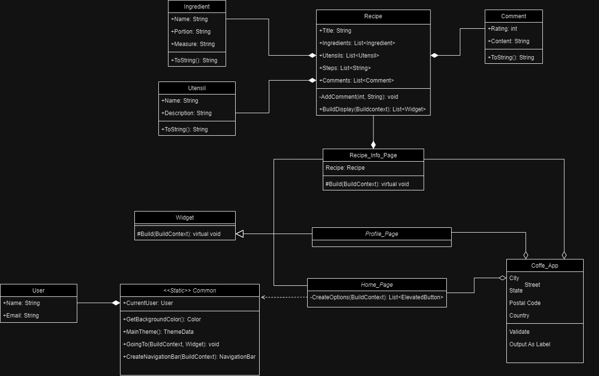
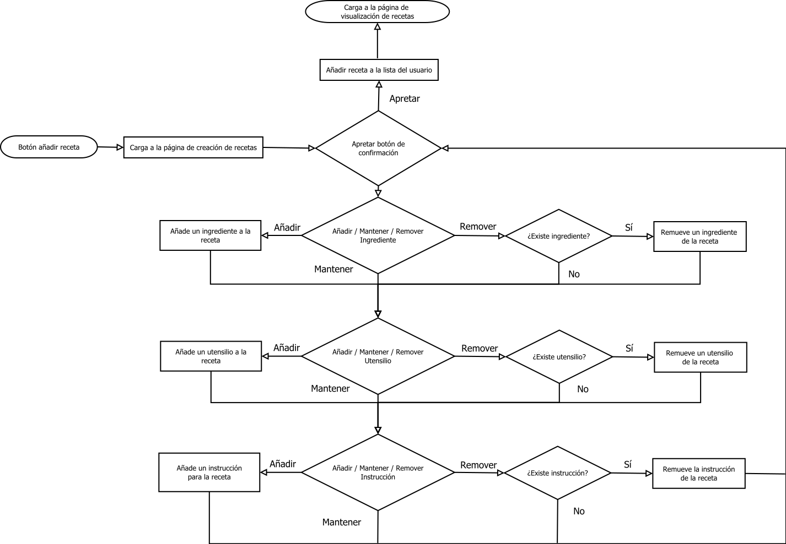
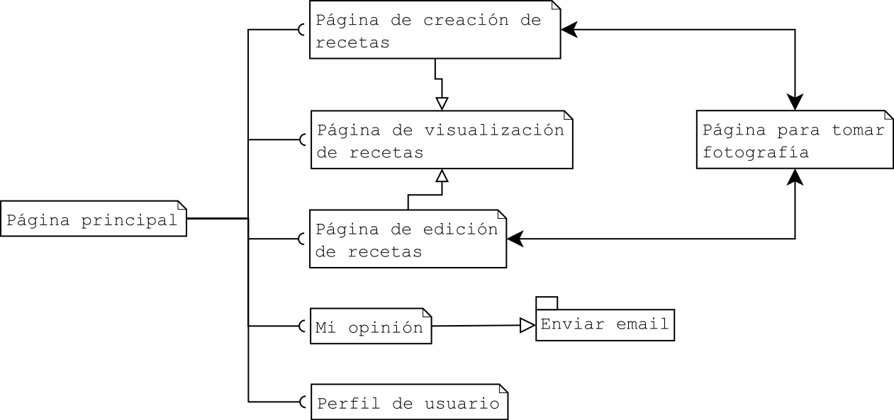

Descripción:
Esta aplicación está pensada para los amantes del café, la que permitirán
crear, almacenar y compartir sus recetas favoritas. Aplicación creada
a través de la herramienta Flutter pensada para dispósitivos móviles.

Diagrama de clases:

Diagrama de flujo:

Diagrama de arquitectura: 

Requerimientos:
1. Página de inicio que funcione como menú de acceso a distintas recetas.
2. Menú de acceso a diversas funciones como "Ver perfil".
3. Validar la entrada del usuario.
4. Creación, edición y visualización de recetas en la app.
5. Persistencia de datos (Guardar y cargar recetas).
6. Splashscreen que muestre el logo de la app.
7. Guardar las recetas favoritas del usuario.
8. Cargar fotos desde la galería y tomar fotos con la cámara.
9. Compartir recetas entre usuarios.
10. Poder contestar el cuestionario que lo recibirá el desarrollador
